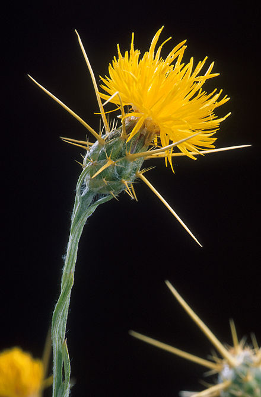

---
title:
author: "cjlortie"
date: "2017"
output:
  html_document:
    theme: spacelab
    toc: yes
    toc_depth: 3
    toc_float: yes
  pdf_document:
    toc: yes
---
#Phenotypic plasticity in yst
###Purpose
To formally review the research to date on the phenotypic plasticity of the invasive plant species Centaurea solstitialis.
<br>


<br>

Ramona Irimia and Daniel Montesinos lead on primary research analyses.

###meta-data
```{r meta-data, warning=FALSE, message=FALSE}
library(tidyverse)


```

###data wrangle
```{r data, warning=FALSE, message=FALSE}
data <- read_csv("data/lit.data.csv")
data

```

###review summary


###data viz
```{r viz, warning=FALSE, message=FALSE}
ggplot(data, aes(Ecosystem, fill = hypothesis)) + geom_bar()


```
